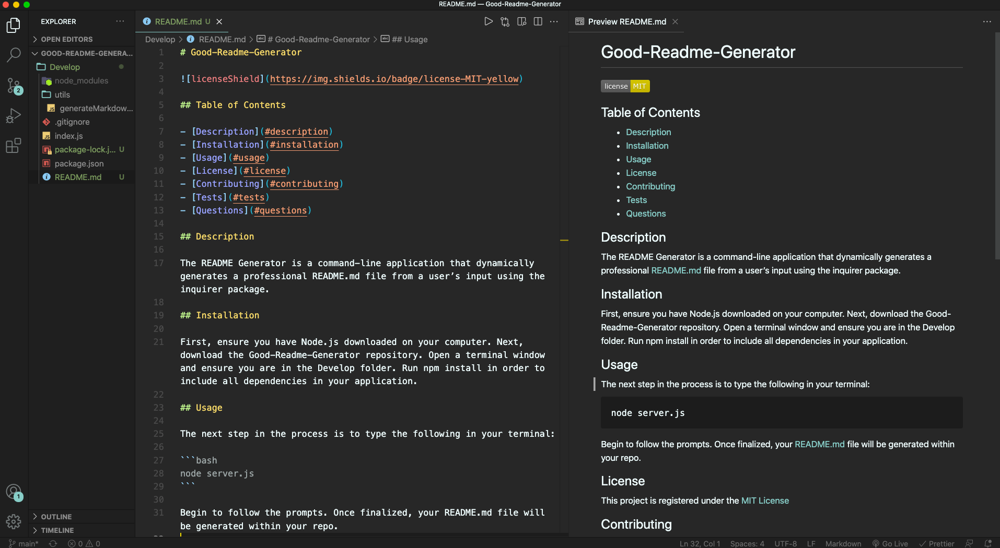

# Good-Readme-Generator


## Table of Contents

- [Description](#description)
- [Installation](#installation)
- [Usage](#usage)
- [License](#license)
- [Contributing](#contributing)
- [Tests](#tests)
- [Questions](#questions)

## Description

This README Generator is a command-line application that dynamically generates a professional README.md file from a user’s input using the inquirer package.

## Installation

First, ensure you have Node.js downloaded on your computer. Next, download this Good-Readme-Generator repository. Open a terminal window and ensure you are in the Develop folder. Run npm install in order to include all dependencies in your application.

## Usage

The next step in the process is to type the following in your terminal:

```node server.js

```

Begin to follow the prompts. Once finalized, your README.md file will be generated within your repo.

## Video

Link to [Good-Readme-Generator Video Walkthrough](https://drive.google.com/file/d/1WNiwciQzrEhzqrhNfmEhhf8wspItfrZY/view?usp=sharing)



## License

This project is registered under the [MIT License](/LICENSE)

## Contributing

- Allie Soliz - GitHub: azs6189

## Tests

- None

## Questions

- **GitHub:** [github.com/azs6189](https://github.com/azs6189)
- **Email:** [solizale@gmail.com](mailto:solizale@gmail.com)  
  _This README was created using the [README Generator](https://github.com/azs6189/Good-Readme-Generator)_
